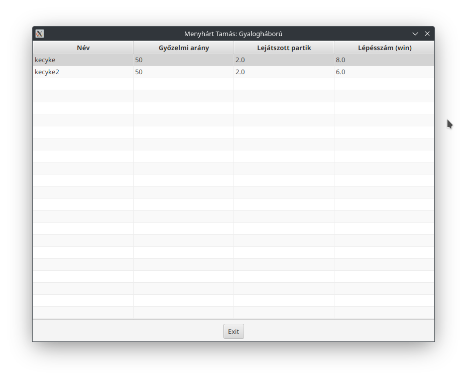

# Sakkprogram: gyalogháború

### Menyhárt Tamás

A gyalogháború lényege, hogy felpakoljuk a figurákat a sakk szabályai szerint, de csak a gyalogokat. Lépünk a jatéknak megfelelően, és az nyer, aki előbb eljut az ellenfél alapsorára vagy leüti az ellenfél összes bábúját.

Nem enged szabálytalan lépéseket, CSS is van benne használva az interaktív élményért.

Jelenleg nem fog rendelkezni gépi játékossal, de ez a jövőben változhat.

Később tervben van több figura, és akár a rendes sakkjáték is.

How to run: Java 21 (minimum JDK 17 and maven 3.7)

```bash
git clone https://github.com/EgyipTomi425/gyaloghaboru.git
cd gyaloghaboru
mvn clean install
mvn compile
mvn exec:java
```

Indításkor elkéri a játékosneveket. Alapértelmezetten a rendszer felhasználójának a neve.


Játék közben így néz ki a tábla:


Egy lejátszott játék után az új játék megnyomásakor mentést is készít az eredményekről, több lejátszott játék után pedig az eredménytáblán lesznek rekordok. 



Források: Jeszy75 (Jeszenszky Péter) tárolója.
